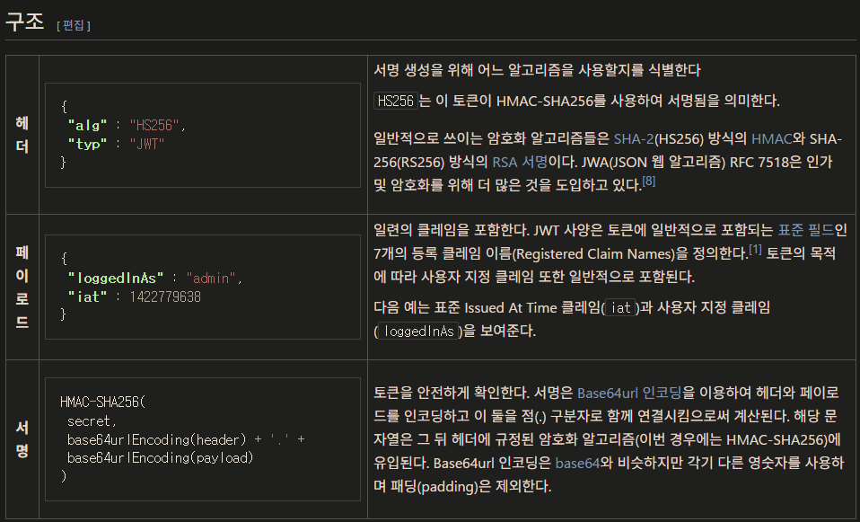

## 토큰 재발급 플로우

```
1. 토큰 유효성 검증: `tokenGenerator.validateToken(token)`
2. 사용자 ID 추출: `tokenGenerator.getUserIdFromToken(token)`  
3. 사용자 조회: `userRepository.findUserById(userId)`
4. 저장된 토큰과 비교: `token.equals(user.getRefreshToken())`
5. 새 토큰 발급: `issueToken(user)` → 새로운 access/refresh 토큰 쌍 생성
6. DB 갱신: `user.updateRefreshToken(refreshToken)` (issueToken 내부에서 실행)
7. 토큰 반환: 새로 발급된 토큰 Map 반환


Sliding Window 방식 
Sliding Window 방식으로 JWT 토큰 갱신을 구현하는 방법은 다음과 같습니다:

액세스 토큰 발급:

액세스 토큰에 만료 시간을 설정하되, 일반적인 토큰 만료 시간보다 좀 더 길게 설정합니다.
예를 들어 액세스 토큰 만료 시간을 1시간으로 설정할 수 있습니다.
토큰 갱신 시점 체크:

클라이언트가 API를 호출할 때마다 액세스 토큰의 만료 시간을 확인합니다.
만료 시간이 일정 기준(예: 10분) 이내로 다가오면 토큰 갱신이 필요한 것으로 간주합니다.
토큰 갱신 처리:

토큰 갱신이 필요한 경우, 클라이언트는 기존 액세스 토큰과 함께 갱신 요청을 서버에 보냅니다.
서버에서는 기존 토큰의 유효성을 확인하고, 유효하다면 새로운 액세스 토큰을 발급합니다.
새로운 토큰의 만료 시간은 이전 토큰의 만료 시간에서 갱신 시점까지의 시간을 더한 값으로 설정합니다.
토큰 만료 시간 갱신:

클라이언트는 새로 발급받은 토큰을 사용하여 API를 호출합니다.
이때 서버에서는 토큰의 만료 시간을 다시 계산하여 클라이언트에게 전달합니다.
이와 같은 Sliding Window 방식을 사용하면 사용자 활동에 따라 토큰 만료 시간이 자동으로 연장되어, 
별도의 리프레시 토큰 없이도 효과적인 토큰 관리가 가능합니다.

```




## 네이밍에 일관성을 주는 방법

```
1. {Domain}{Purpose} 패턴
 
 API 리소스(DTO 포함)의 이름은 명확하고 일관성 있어야 한다.

 •요약: 일관된 네이밍 컨벤션은 API를 이해하고 사용하기 쉽게 만드는 핵심 요소.
 •링크: Microsoft - API Design Best Practices: 마소 공식 문서.
```


## logout flow

```
로그아웃 버튼 클릭 → /api/logout 등 백엔드 로그아웃 엔드포인트 호출

서버에서 세션 삭제, 로그 기록 등 처리

클라이언트에서 쿠키/스토어 초기화

홈페이지로 이동

```

### 보안권위자 팀 메클레인(Tim McLean)
```
`alg` 필드를 사용하여 토큰의 유효성을 잘못 확인하는 일부 JWT 라이브러리의 취약성을 보고하였다.
이 취약점들이 패치가 되었으나 메클레인은 비슷한 구현체 혼동을 예방하기 위해 `alg` 필드를 구식 처리하는 것을 제안하였다.
 적절히 설계할 경우 개발자는 일부 주의를 기울이면 알고리즘 취약성을 해결할 수 있다.
 
 
- JWT 헤더만으로 유효성을 확인하지 않을 것
- 알고리즘을 인지할 것
- 적절한 키 크기를 사용할 것
```

## refreshToken flow

```
httponly 쿠키로 보내서 별로 신경 안써도댐


```


## accessToken flow 
```
[url] vs [body]
sending an access token in the URL (as a query parameter) or in the request body depends on the HTTP method and security considerations.
- [url]
1. URL fragment로 전달 : AuthSuccessHandler에서 callback/page.tsx로 바로 전달. # = 
인증할 떄 생성 된 임시 쿠키는 스프링에서 없앰. 리프레시토큰은 httponly쿠키로.
2. 상태에 액세스토큰 저장하고 홈으로 리다이렉트. 홈에서 또 유저정보 요청.


1. body로 전달 : authSuccessHandler는 인증할 떄 생긴 refresh 쿠키를 db에 넣고 전달.
2. 프론트는 accessToken과 유저정보를 요청. 
3. 스프링은 쿠키로 확인. 하고 준다.


답은 아묻따 body
근거 : URL 프라그먼트와 쿼리 파라미터의 공통된 보안 문제가 있다.
0. 프록시 로그 노출: 둘 다 프록시 서버나 웹 서버의 접근 로그에 그대로 남기 때문에, 해커가 서버 로그를 탈취하면 토큰이 유출 가능성이 ㅇ ㅣㅆ다.
1. changing a query parameter will affect caching.
2. 모바일의 경우 #fragment를 읽는 게 있다고 함.
3. 브라우저 히스토리 노출: 둘 다 브라우저의 주소창에 그대로 노출돼서, 브라우저 히스토리에 토큰이 그대로 남아
3. Referer 헤더 노출: 만약 사용자가 이 URL을 통해 다른 사이트로 이동하면, Referer 헤더에 이 URL이 그대로 담겨서 토큰이 외부 사이트로 유출될 가능성이 있다.


OAuth2 성공: 스프링에서 onAuthenticationSuccess가 실행돼.

토큰 생성: 스프링이 토큰을 생성해서 HTTP 요청 헤더에 담고, 클라이언트에게 돌려줘.

콜백 페이지 리다이렉트: 스프링은 토큰을 포함하지 않은 채 localhost:3000/oauth2/callback으로 리다이렉트해.

클라이언트에서 토큰 요청: Next.js의 콜백 페이지가 렌더링되면, 다시 스프링으로 API 요청을 보내서 토큰을 받아와.

        // 액세스 토큰은 URL fragment로 전달) : AuthSuccessHandler에서 callback/page.tsx로 바로 전달.
        // vs HTTP 요청의 Authorization 헤더에 Bearer 뒤에 토큰을 붙여 전달 :
        // 스프링에서 sendRedirect -> 클라에서 /callback 렌더되면 패치요청 -> 액세스토큰(3분짜리) 받으면 -> 리덕스 액션(로컬스토리지에 저장? state에 저장? 둘 중 더 휘발성인 메모리에 저장.)
        // -> Simplurl어쩌구 vs Defaultauthentic어쩌구  ->
        // simpleurl이면 authcallback페이지로 보내주고 처리하게 url리더가 변환 :  DefaultAuth면 그냥 바디에 패치 그럼 리듀서가 가로채서 상태에 저장.

 
 
 

```

###  loadUser 메서드:
```
이 메서드는 오직 "이 사용자가 존재하는지 확인하고, DB에 저장(업데이트)하는" 역할만 해.

여기서 refreshToken을 추출해서 User 엔티티에 저장하는 건 보안 원칙 위반이야.
```


### User에 리프레시토큰 칼럼을 넣는게 refreshtokenRepository에서 findByUser하는 것 보다 빠르지?

"User 엔티티에 refreshToken 칼럼을 넣으면
userRepository.findById() 같은 쿼리 한 번으로 유저 정보랑 토큰을 한꺼번에 가져오니까,
쿼리 한 번이 두 번보다 빠르다"
는 맞는 말. 상을 줘야함. 
치명상 + 처맞는 말

``` 

실제 서비스에서는 사용 빈도를 고려해야 해.
User 테이블: 거의 모든 API 요청에서 유저 정보를 가져와야 하니까, 매우 자주 조회돼.
RefreshToken 테이블: 토큰을 갱신할 때만(보통 몇 시간, 며칠에 한 번) 조회돼.
만약 User 테이블에 refreshToken 칼럼을 추가하면, 
자주 사용되는 User 테이블의 **데이터 크기(row size)**가 늘어나.
그러면 DB의 캐싱 효율이 떨어지고, 디스크 I/O가 늘어나서 결국 전체적인 서비스 성능이 느려져.

반면에 RefreshToken 테이블을 따로 두면,
가장 자주 사용되는 User 테이블은 가볍고 빠르지.
RefreshToken 테이블은 user_id에 인덱스가 걸려있어서
findByUser 쿼리가 매우 빠르게 동작해. (마치 해시맵에서 값을 찾는 것처럼)
결론적으로, 토큰 갱신을 위한 한두 번의 쿼리보다, 
매번 일어나는 유저 정보 조회 성능을 최적화하는 게 훨씬 이득이야.

가장 자주 사용되는 데이터를 가장 효율적으로 관리하는 것.
이건 '성능 최적화'의 기본 원칙 중 하나야.
 
```


### OAuth2에서 제공받는 토큰(`refresh_toke`) 사용. -> 직접 RefreshToken 만들어서 사용,관리.

Logout을 구현하던 중...

```

### oauth2 - `refresh_toke` 사용의 단점 분석.

1. 토큰 폐기 (Token Revocation) 문제.
유저가 로그아웃 했을때, refreshToken을 무효화해야 한다.
하지만 OAuth2 제공자로부터 받은 토큰에 대한 제어권은 각 소셜의 개발자센터에서 제어해야함.
이건 분명 협업시 불편함이 발생함. 그냥 내부에서 제어하도록 구현하는게 차라리 편할 듯. 그리 어렵지도 않으니.

2. 각 소셜의 정책이 일관되는지도 의문. 
OIDC라곤 하지만 토큰 관리 정책도 제공자마다 다를 수 있다.
뭐 하나 바꾸려하면 카ㅏㅋ오개발자센터 드가야되고 구글콘솔드가야되고....

결론은 외부 서비스에 대한 의존성을 줄이는게 맞다.

그리고 뭣보다 세션리스로 해놨는데 
JSession어쩌구 하는 세션이 클라이언트에 생길지도 의문이고,

가장 중요한건 토큰에 클레임정보, 암호화 알고리즘, 만료 시간을 직접 제어하고싶었다.ㅎ

```

### JWT JWTS JWE JWA 

용어 역할	      기능	  데이터 노출	주요 적용
JWT	컨테이너  	통일 포맷	   X	인증, 정보교환
Jws	서명포장	    무결성 보장	   O	인증/권한, 변조방지
JWE	암호화포장	기밀성 보장     X	비밀정보 전달
JWA	알고리즘규격	암호,서명정의	-	암호/서명 선택

```

Jws Payload클래스,

refreshToken은 Jws라 네이밍짓는다.


Jws는 oauth2인증 후에 자체적으로 생산해서 우리 DB에 저장하고  

클라이언트한테 httpOnly쿠키로 줌.


인증이 필요한 요청에 대한 검증 차원에서 Jwa을 사용해.


jwtToken은 만료기간이 3분이고, 
```
